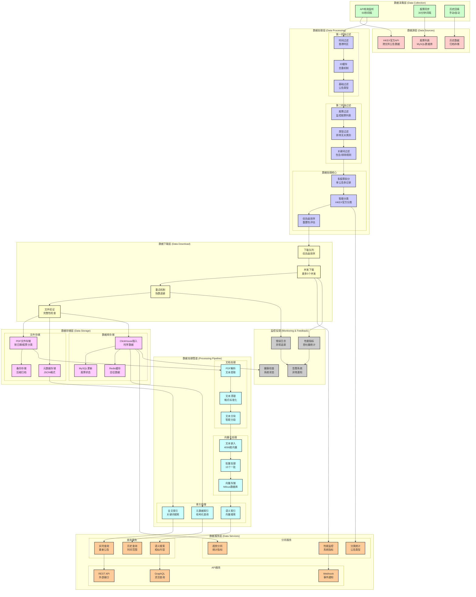

# HKEX公告下载系统数据流图

## 数据流说明

### 主要数据流向

1. **数据采集阶段**
   - API轮询监听每60秒获取最新公告
   - 股票同步每30分钟更新监控股票列表
   - 历史回填支持手动和自动两种模式

2. **双重过滤阶段**
   - 第一阶段：时间过滤、ID去重、基础类型过滤
   - 第二阶段：股票过滤、类型过滤、关键词过滤

3. **并发下载阶段**
   - 优先级排序的下载队列
   - 最多5个并发下载任务
   - 指数退避重试机制

4. **向量化处理阶段**
   - PDF解析和文本提取
   - 4096维向量嵌入
   - 批量处理（15个一批）

5. **存储和索引阶段**
   - ClickHouse存储时序数据
   - Milvus存储向量数据
   - Redis缓存会话数据

### 性能优化点

- **并发处理**: 最多5个并发下载任务
- **批量向量化**: 15个文档一批处理
- **智能缓存**: ID缓存避免重复处理
- **索引优化**: 多维度索引支持快速查询

### 监控指标

- 实时处理吞吐量
- 下载成功率
- 向量化处理速度
- 系统健康状态

---

*生成时间: 2025-10-20*
*数据流版本: v2.1*