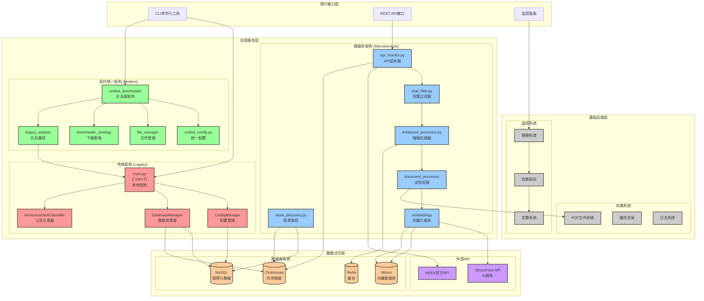

# HKEX公告下载系统架构图

## 架构说明

### 三层架构设计

1. **传统架构** (红色)
   - 基于main.py的单体架构
   - 代码量2,100+行
   - 适用于简单任务和向后兼容

2. **微服务架构** (蓝色)
   - 分布式微服务设计
   - 代码量29,000+行
   - 高内聚低耦合，易于扩展

3. **现代统一架构** (绿色)
   - 企业级模块化设计
   - 支持策略模式和依赖注入
   - 100%向后兼容

### 数据库系统集成

- **MySQL**: 存储股票元数据和公司信息
- **ClickHouse**: 时序数据存储，支持高性能查询
- **Milvus**: 向量数据库，支持语义搜索
- **Redis**: 缓存和会话管理

### 外部服务集成

- **HKEX API**: 港交所官方公告数据源
- **SiliconFlow API**: AI服务，提供文本嵌入和LLM服务

---

*生成时间: 2025-10-20*
*系统版本: v2.1*