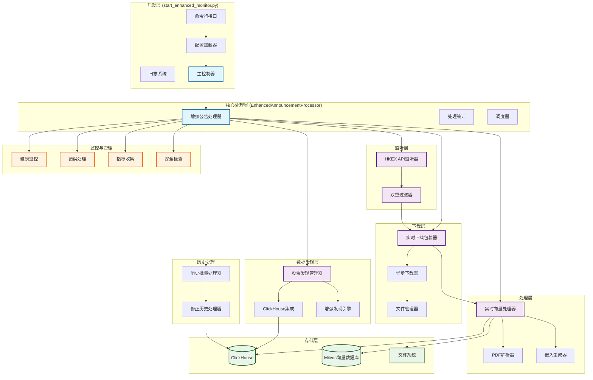
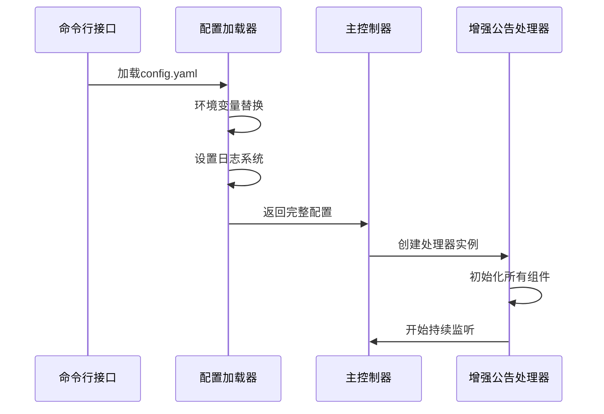
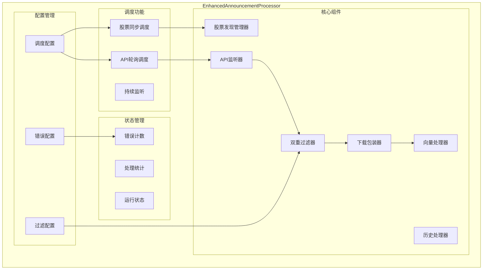
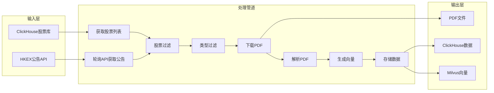

# HKEX 增强公告监听系统架构图

## 系统总览

## 详细组件架构

### 1. 启动控制流程

### 2. 核心处理器组件详图

### 3. 数据流处理管道

### 4. 监控与错误处理系统

```mermaid
graph TB
    subgraph "监控系统"
        HEALTH[健康监控]
        METRICS[指标收集器]
        RESOURCE[资源监控]
        SYSTEM[系统监控]
    end
    
    subgraph "错误处理"
        ERROR_CLASS[错误分类器]
        ERROR_HANDLER[统一错误处理器]
        GRACEFUL[优雅降级]
        RECOVERY[错误恢复]
    end
    
    subgraph "安全模块"
        CONFIG_CHECK[配置检查]
        ENV_VALID[环境验证]
        STARTUP_CHECK[启动检查]
    end
    
    HEALTH --> METRICS
    METRICS --> RESOURCE
    RESOURCE --> SYSTEM
    
    ERROR_CLASS --> ERROR_HANDLER
    ERROR_HANDLER --> GRACEFUL
    GRACEFUL --> RECOVERY
    
    CONFIG_CHECK --> ENV_VALID
    ENV_VALID --> STARTUP_CHECK
```

## 核心特性

### 🎯 主要功能
- **实时监听**: 轮询HKEX公告API，实时获取最新公告
- **智能过滤**: 双重过滤机制（股票过滤 + 类型过滤）
- **自动下载**: 异步批量下载PDF文件
- **向量化处理**: 自动解析PDF并生成向量嵌入
- **数据存储**: 结构化数据存储到ClickHouse，向量存储到Milvus

### 🔧 系统能力
- **并发处理**: 支持高并发下载和处理
- **错误恢复**: 完善的错误处理和重试机制
- **配置驱动**: 完全基于YAML配置文件管理
- **模块化设计**: 松耦合的组件架构
- **监控完善**: 详细的系统监控和统计

### 📊 数据流向
1. **发现阶段**: 从ClickHouse发现监控股票列表
2. **监听阶段**: 实时轮询HKEX API获取公告
3. **过滤阶段**: 双重过滤保留感兴趣的公告
4. **下载阶段**: 异步下载PDF文件到本地
5. **处理阶段**: 解析PDF并生成向量嵌入
6. **存储阶段**: 数据存储到数据库和向量库

### 🚀 启动模式
- **正常模式**: `python start_enhanced_monitor.py`
- **测试模式**: `python start_enhanced_monitor.py -t`
- **自定义配置**: `python start_enhanced_monitor.py -c custom_config.yaml`

## 技术栈

- **Python**: 主要编程语言
- **AsyncIO**: 异步编程框架
- **ClickHouse**: 时序数据存储
- **Milvus**: 向量数据库
- **YAML**: 配置文件格式
- **aiohttp**: 异步HTTP客户端
- **PyMuPDF**: PDF处理库

---

*该系统架构图反映了 HKEX 增强公告监听系统的完整技术架构和数据流程*
