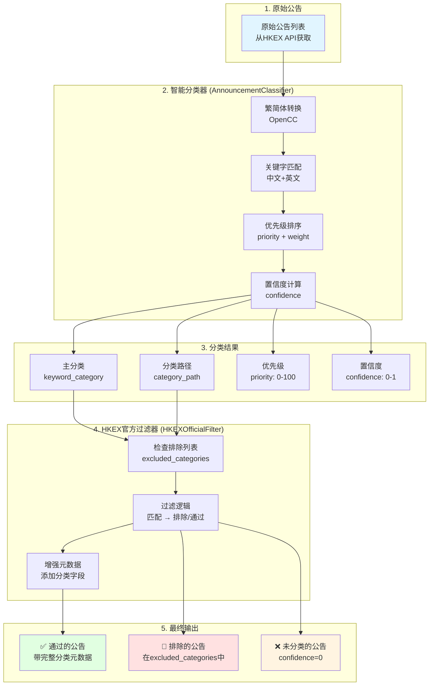

# 公告分类过滤机制详解

## 🎯 整体架构



## 📋 分类体系

### 核心配置：`common_keywords`

从 `config.yaml` 中定义了 **30+ 个关键字分类**，每个分类包含：

```yaml
common_keywords:
  privatization:  # 分类标识
    chinese: ["私有化", "除牌", "退市"]  # 中文关键字
    english: ["Privatization", "Delisting"]  # 英文关键字
    folder_name: "私有化"  # 显示名称
    priority: 85  # 优先级 (0-100)
    weight: 1.0   # 权重 (0-1)
```

### 分类等级体系

| 优先级范围 | 等级标识 | 典型分类 |
|-----------|---------|---------|
| **90-100** | 🚨 特高优先级 | IPO（90） |
| **70-89** | 🔴 高优先级 | 私有化（85）、全购（80）、合股（75）、年报（80）、中期报告（75） |
| **55-69** | 🟡 中优先级 | 供股（60）、配股（55）、季度业绩（65） |
| **0-54** | 🟢 低优先级 | 回购（40）、股息（50）、须予披露交易（20） |

### 完整分类列表（前20个）

| 分类 | folder_name | 优先级 | 权重 | 中文关键字示例 |
|------|------------|--------|------|--------------|
| IPO | IPO | 90 | 1.0 | 首次公开发售、新股上市 |
| 私有化 | 私有化 | 85 | 1.0 | 私有化、除牌、退市 |
| 年报 | 年报 | 80 | 1.0 | 年报、年度报告 |
| 全购 | 全购 | 80 | 1.0 | 全购、全面收购、强制性收购 |
| 合股 | 合股 | 75 | 0.9 | 合股、股份合并、股本重组 |
| 中期报告 | 中期报告 | 75 | 1.0 | 中期报告、中期业绩、半年报 |
| 拆股 | 拆股 | 70 | 0.9 | 拆股、股份分拆 |
| 季度业绩 | 季度业绩 | 65 | 0.9 | 季度业绩、季报 |
| 供股 | 供股 | 60 | 0.8 | 供股、权利股 |
| 配股 | 配股 | 55 | 0.8 | 配股、配售、股份配售 |
| 可转换 | 可转换 | 50 | 0.7 | 可转换、可换股债券 |
| 股息 | 股息 | 50 | 0.7 | 股息、分红、派息 |
| 内幕消息 | 内幕消息 | 45 | 0.6 | 内幕消息、内部消息 |
| 回购 | 回购 | 40 | 0.6 | 回购、股份回购 |
| 增发 | 增发 | 40 | 0.7 | 增发、增资 |
| 更名 | 更名 | 30 | 0.5 | 更名、改名 |
| 停牌 | 停牌 | 30 | 0.5 | 停牌、暂停买卖 |
| 复牌 | 复牌 | 30 | 0.5 | 复牌、恢复买卖 |
| 须予披露交易 | 须予披露交易 | 20 | 0.2 | 须予披露的交易 |

## 🔍 分类流程详解

### 步骤 1：繁简体转换

```python
def _convert_text(self, text: str) -> List[str]:
    """将文本转换为繁简体版本"""
    variants = [text]  # 原始文本
    
    # 使用 OpenCC 转换
    traditional = self.s2t_converter.convert(text)  # 简→繁
    simplified = self.t2s_converter.convert(text)   # 繁→简
    
    return [text, traditional, simplified]
```

**示例**：
- 原始标题：`"建議股本重組及供股"`
- 转换后：
  1. `"建議股本重組及供股"` (原文)
  2. `"建议股本重组及供股"` (简体)

### 步骤 2：关键字匹配

```python
def _match_keyword_category(self, title: str) -> Tuple[str, str, float]:
    """根据公告标题匹配关键字分类"""
    
    # 遍历所有分类
    for category_key, category_config in self.keyword_config.items():
        chinese_keywords = category_config.get('chinese', [])
        english_keywords = category_config.get('english', [])
        
        # 检查中文关键字
        for keyword in chinese_keywords:
            for title_variant in title_variants:
                if keyword.lower() in title_variant:
                    matched_keywords.append({
                        'folder_name': folder_name,
                        'keyword': keyword,
                        'priority': priority,
                        'weight': weight,
                        'confidence': 0.9
                    })
```

**示例**：
- 标题：`"建議股本重組及供股"`
- 匹配到：
  1. **合股**（关键字：`"股本重組"`, priority=75, weight=0.9）
  2. **供股**（关键字：`"供股"`, priority=60, weight=0.8）

### 步骤 3：优先级排序

```python
# 按优先级和权重排序
matched_keywords.sort(key=lambda x: (x['priority'], x['weight']), reverse=True)

# 主要分类使用最高优先级
primary_match = matched_keywords[0]
primary_category = primary_match['folder_name']  # "合股"

# 所有匹配关键字
all_keywords_str = "合股+供股"
```

**结果**：
- **primary_category** = `"合股"` (priority=75更高)
- **all_keywords** = `"合股+供股"` (所有匹配项)
- **confidence** = `0.81` (最高置信度 × 权重)

### 步骤 4：HKEX官方过滤

```python
async def filter_announcements(self, raw_announcements):
    """使用HKEX官方分类过滤公告"""
    
    for announcement in raw_announcements:
        # 调用分类器
        category_path, keyword_category, priority, confidence = \
            self.classifier.classify_announcement(announcement)
        
        # 检查是否在排除列表中
        if keyword_category in self.excluded_categories:
            classification_stats['excluded'] += 1
            continue  # ❌ 排除
        
        # 增强元数据
        enhanced_announcement = {
            **announcement,
            'hkex_level1_code': 'KEYWORD',
            'hkex_level1_name': '关键字分类',
            'hkex_level2_code': keyword_category,
            'hkex_level2_name': keyword_category,
            'hkex_level3_code': category_path,
            'hkex_level3_name': category_path,
            'hkex_full_path': f"关键字分类/{keyword_category}/{category_path}",
            'hkex_classification_confidence': confidence,
            'hkex_classification_method': 'keyword_fallback'
        }
        
        filtered_announcements.append(enhanced_announcement)  # ✅ 通过
```

## 🚫 排除分类列表

从 `config.yaml` 中定义了 **21个排除分类**：

```yaml
excluded_categories:
  - "翌日披露報表"        # 常规报表
  - "展示文件"            # 程序性文件
  - "月報表"              # 月度报表
  - "股东周年大会"        # 会议通知
  - "股东特别大会"
  - "证券变动月报表"
  - "ESG报告"
  - "股東週年大會通告"
  - "股東特別大會通告"
  - "申請表格"            # 表格文件
  - "代表委任表格"
  - "通函"                # 通知文件
  - "通知"
  - "月度報告"
  - "半年報"              # 定期报告
  - "中期業績"
  - "年度業績"
  - "財務摘要"
  - "財務報表"
  - "證券變動月報表"
  - "環境、社會及管治報告"
```

### 排除逻辑

```python
# 检查是否在排除列表中
if keyword_category in self.excluded_categories or \
   category_path in self.excluded_categories:
    # ❌ 排除此公告
    classification_stats['excluded'] += 1
    logger.debug(f"🚫 排除公告: {title} (分类: {keyword_category})")
    continue
```

## 📊 过滤统计

每次过滤都会生成详细统计：

```python
classification_stats = {
    'total': 100,              # 总输入公告数
    'passed': 45,              # ✅ 通过的公告
    'excluded': 30,            # 🚫 排除的公告（在excluded_categories中）
    'failed_confidence': 5,    # ❌ 置信度不足
    'failed_classification': 20, # ❌ 未匹配任何分类
    'errors': 0                # ❌ 处理错误
}
```

**日志示例**：
```
📊 HKEX官方分类过滤统计:
  总数: 100
  ✅ 通过: 45
  🚫 排除: 30
  ❌ 置信度不足: 5
  ❌ 分类失败: 20
  ❌ 处理错误: 0
  📈 通过率: 45.0%

🏷️ 一级分类分布: {'KEYWORD-关键字分类': 45}
🏷️ 二级分类分布: {'合股-合股': 12, '供股-供股': 10, 'IPO-IPO': 8, ...}
🏷️ 三级分类分布: {'合股-合股': 8, '合股+供股-合股': 4, ...}
```

## 🎯 实战示例

### 示例 1：复杂公告 - 多关键字匹配

**输入**：
```json
{
  "TITLE": "建議股本重組、供股及可換股債券",
  "STOCK_CODE": "00123"
}
```

**处理流程**：

1. **繁简体转换**：
   - `"建議股本重組、供股及可換股債券"` (繁体)
   - `"建议股本重组、供股及可换股债券"` (简体)

2. **关键字匹配**：
   - ✅ **合股** (关键字: "股本重組", priority=75, weight=0.9, confidence=0.9)
   - ✅ **供股** (关键字: "供股", priority=60, weight=0.8, confidence=0.9)
   - ✅ **可转换** (关键字: "可換股債券", priority=50, weight=0.7, confidence=0.9)

3. **优先级排序**：
   - 排序结果：[合股(75), 供股(60), 可转换(50)]
   - **primary_category** = `"合股"` (最高优先级)
   - **all_keywords** = `"合股+供股+可转换"`

4. **置信度计算**：
   - max_confidence = max(0.9×0.9, 0.9×0.8, 0.9×0.7) = **0.81**

5. **过滤检查**：
   - `"合股"` 不在 `excluded_categories` 中 ✅
   - **结果**：通过

**输出**：
```json
{
  "TITLE": "建議股本重組、供股及可換股債券",
  "STOCK_CODE": "00123",
  "hkex_level1_code": "KEYWORD",
  "hkex_level1_name": "关键字分类",
  "hkex_level2_code": "合股",
  "hkex_level2_name": "合股",
  "hkex_level3_code": "合股+供股+可转换",
  "hkex_level3_name": "合股+供股+可转换",
  "hkex_full_path": "关键字分类/合股/合股+供股+可转换",
  "hkex_classification_confidence": 0.81,
  "hkex_classification_method": "keyword_fallback"
}
```

### 示例 2：被排除的公告

**输入**：
```json
{
  "TITLE": "截至二零二五年九月三十日止六個月之中期業績",
  "STOCK_CODE": "00700"
}
```

**处理流程**：

1. **关键字匹配**：
   - ✅ **中期报告** (关键字: "中期業績", priority=75)

2. **过滤检查**：
   - `"中期業績"` 在 `excluded_categories` 中 ❌
   - **结果**：排除

**输出**：
```
🚫 排除公告: 截至二零二五年九月三十日止六個月之中期業績... (分类: 中期报告)
```

### 示例 3：未匹配分类的公告

**输入**：
```json
{
  "TITLE": "董事會成員變動公告",
  "STOCK_CODE": "01234"
}
```

**处理流程**：

1. **关键字匹配**：
   - ❌ 无匹配 (不包含任何配置的关键字)

2. **分类结果**：
   - category_path = `""`
   - keyword_category = `""`
   - confidence = `0.0`

3. **过滤检查**：
   - confidence = 0 ❌
   - **结果**：未分类，不通过

**输出**：
```
❌ 无有效分类: 董事會成員變動公告... (置信度: 0.00)
```

## 🔧 配置调优

### 调整排除列表

如果想**保留**某些类型的公告（比如中期业绩），从 `excluded_categories` 中移除：

```yaml:config.yaml
excluded_categories:
  # - "中期業績"  # 注释掉，不再排除中期业绩
  - "月報表"
  - "股东周年大会"
  # ...
```

### 添加新的分类

在 `common_keywords` 中添加：

```yaml:config.yaml
common_keywords:
  # ... 现有分类 ...
  
  # 新增：董事变动分类
  director_change:
    chinese: ["董事會成員變動", "委任董事", "董事辞任"]
    english: ["Director Change", "Appointment of Director"]
    folder_name: "董事变动"
    priority: 40
    weight: 0.6
```

### 调整优先级策略

修改现有分类的优先级：

```yaml:config.yaml
common_keywords:
  privatization:
    # ...
    priority: 90  # 提升私有化优先级到90（与IPO同级）
```

## 📊 性能指标

| 指标 | 典型值 | 说明 |
|------|--------|------|
| 通过率 | 40-60% | 取决于排除列表配置 |
| 多分类命中率 | 20-30% | 单个公告匹配多个分类 |
| 分类准确率 | 85-95% | 关键字匹配准确度 |
| 平均处理速度 | 0.001秒/条 | 纯内存匹配，无API调用 |

## 🚀 未来改进

目前使用 **关键字分类回退方案**，代码中有多处 TODO：

```python
# TODO: 实现真正的HKEX官方分类系统
# TODO: 实现真正的HKEX官方3级分类系统
```

### 计划中的改进

1. **HKEX官方分类API集成**：
   - 调用港交所官方的分类接口
   - 获取更精准的 3 级分类代码

2. **机器学习分类器**：
   - 训练文本分类模型
   - 提升未知公告的分类能力

3. **动态关键字学习**：
   - 自动发现新的公告类型
   - 自动扩充关键字库

4. **分类置信度提升**：
   - 多特征融合（标题 + 分类代码 + 内容摘要）
   - 提升分类准确率

---

## 📝 总结

### 分类过滤核心逻辑

```
原始公告
  ↓
【AnnouncementClassifier】
  1. 繁简体转换
  2. 关键字匹配（30+个分类）
  3. 优先级排序
  4. 置信度计算
  ↓
分类结果（category, priority, confidence）
  ↓
【HKEXOfficialFilter】
  1. 检查排除列表（21个）
  2. 在排除列表中 → 🚫 排除
  3. 不在排除列表中 → ✅ 通过
  4. 增强元数据（添加分类字段）
  ↓
最终输出
  ✅ 通过的公告（40-60%）
  🚫 排除的公告（30-40%）
  ❌ 未分类的公告（5-20%）
```

### 关键参数

- **分类总数**：30+ 个关键字分类
- **排除分类**：21 个（可配置）
- **优先级范围**：0-100（4个等级）
- **置信度阈值**：0.6（当前未使用，预留）
- **通过率**：典型 40-60%

---

**文档版本**: v2.1.0  
**最后更新**: 2025-10-15  
**关键文件**:
- `config.yaml` - 分类和排除配置
- `services/monitor/utils/announcement_classifier.py` - 智能分类器
- `services/monitor/hkex_official_filter.py` - 官方过滤器

