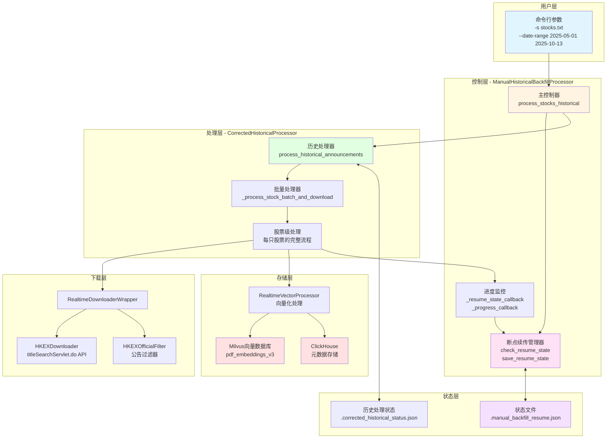
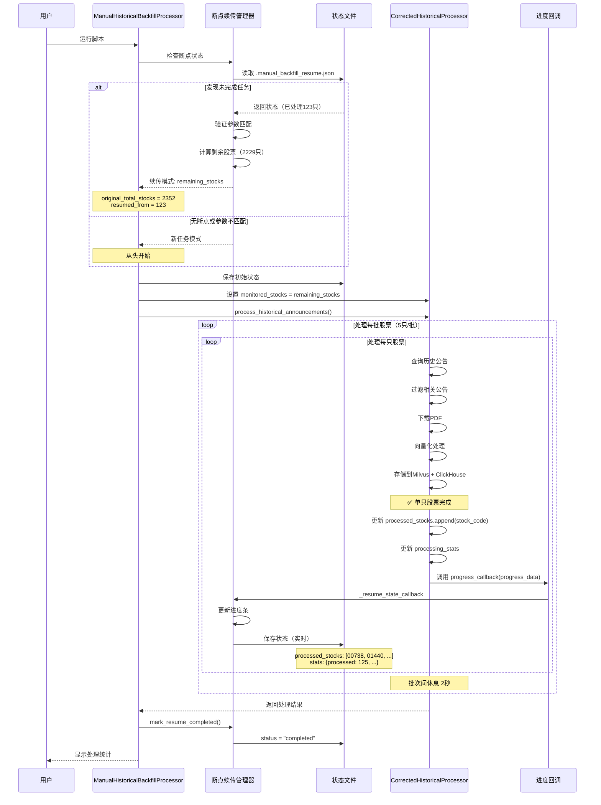
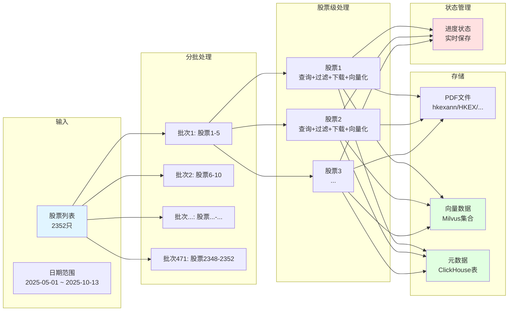
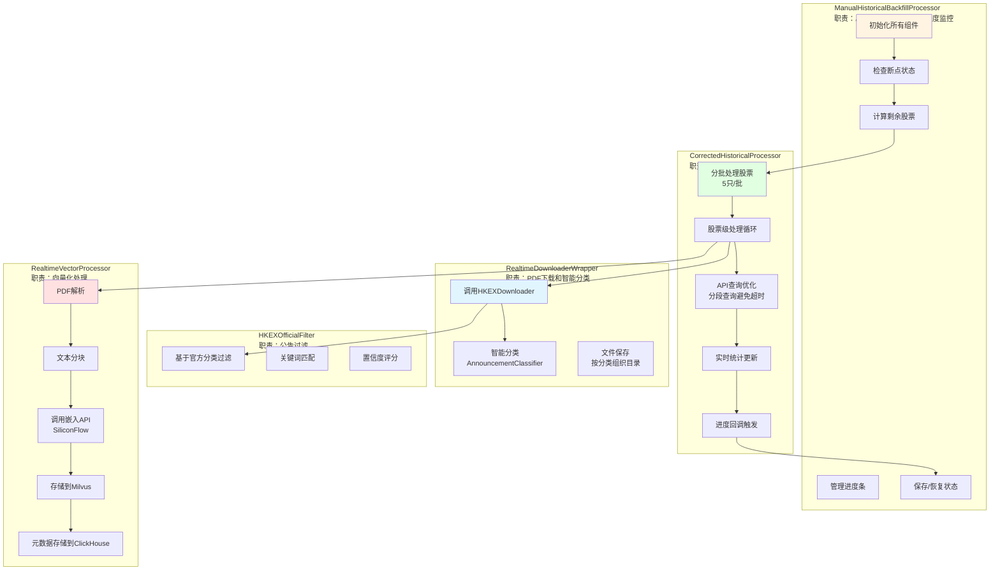
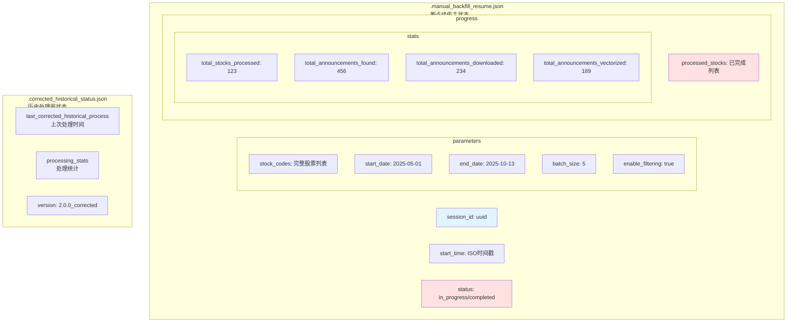
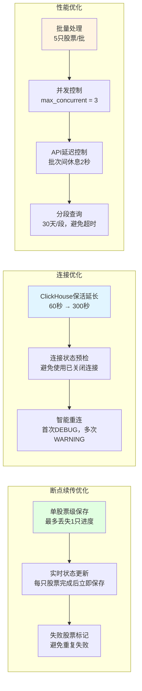
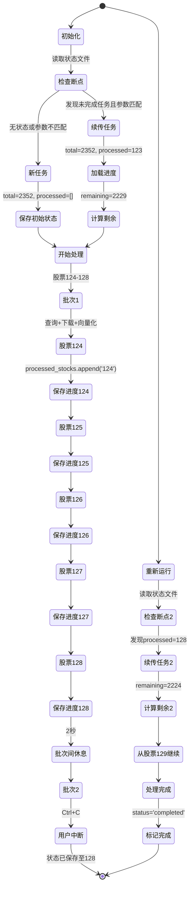

# 历史公告回填脚本架构图

## 🏗️ 整体架构

## 🔄 断点续传流程

## 📦 数据流架构

## 🔧 核心组件详解

## 📊 状态文件结构

## ⚡ 关键优化点

## 🎯 执行流程示例

### 场景：处理2352只股票，中断后续传

## 📈 性能指标

| 指标 | 单位 | 说明 |
|------|------|------|
| 批次大小 | 5只/批 | 平衡并发和内存 |
| 并发限制 | 3个 | 避免API过载 |
| API延迟 | 2秒 | 批次间休息 |
| 日期分段 | 30天/段 | 避免单次查询超时 |
| 断点粒度 | 单只股票 | 最小化重复处理 |
| 状态保存 | 实时 | 每只股票完成后 |
| ClickHouse保活 | 300秒 | 减少重连 |
| 平均处理速度 | 3-8秒/只 | 取决于公告数量 |

## 🔍 监控点

```mermaid
graph TB
    subgraph "日志监控"
        L1[进度日志<br/>📊 处理股票: X/2352]
        L2[股票处理日志<br/>📈 处理股票 00738...]
        L3[批次日志<br/>📦 处理第 X/471 批]
        L4[统计日志<br/>✅ 找到/下载/向量化数量]
    end
    
    subgraph "错误监控"
        E1[连接错误<br/>ClickHouse/Milvus]
        E2[API错误<br/>HKEX查询失败]
        E3[下载错误<br/>PDF下载失败]
        E4[向量化错误<br/>嵌入API失败]
    end
    
    subgraph "性能监控"
        P1[处理速度<br/>秒/只股票]
        P2[成功率<br/>下载/向量化比例]
        P3[重连频率<br/>ClickHouse断线次数]
    end
    
    L1 --> L2
    L2 --> L3
    L3 --> L4
    
    E1 --> E2
    E2 --> E3
    E3 --> E4
    
    P1 --> P2
    P2 --> P3
    
    style L1 fill:#e1f5ff
    style E1 fill:#ffe1e1
    style P1 fill:#e1ffe1
```

---

## 📝 架构设计原则

1. **单一职责**：每个组件负责特定功能
   - `ManualHistoricalBackfillProcessor`：总控和断点续传
   - `CorrectedHistoricalProcessor`：批量处理逻辑
   - `RealtimeDownloaderWrapper`：下载和分类
   - `RealtimeVectorProcessor`：向量化处理

2. **容错设计**：
   - 多层重试机制（ClickHouse 3次，下载器内置重试）
   - 失败股票标记，避免重复尝试
   - 降级处理（批量失败转单个更新）

3. **可观测性**：
   - 详细的进度日志
   - 实时进度条
   - 完整的统计信息
   - 状态文件可检查

4. **性能优化**：
   - 批量处理减少API调用
   - 并发控制避免过载
   - 连接复用减少开销
   - 分段查询避免超时

---

**架构版本**: v2.1.0  
**最后更新**: 2025-10-15

