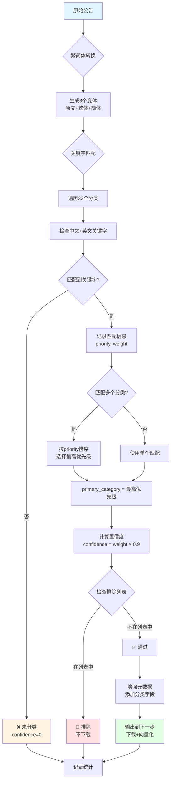

# HKEX公告完整分类规则总览

## 📋 目录

1. [分类体系概览](#分类体系概览)
2. [所有分类详细列表](#所有分类详细列表)
3. [当前排除列表](#当前排除列表)
4. [分类优先级分布](#分类优先级分布)
5. [过滤逻辑流程](#过滤逻辑流程)

---

## 🎯 分类体系概览

### 核心参数

| 参数 | 说明 | 取值范围 |
|------|------|---------|
| **priority** | 优先级，数字越大越重要 | 0-100 |
| **weight** | 权重，影响置信度计算 | 0-1.0 |
| **confidence** | 匹配置信度 | 0-1.0 |

### 分类等级

| 等级 | 优先级范围 | 标识 | 数量 |
|------|-----------|------|------|
| 特高优先级 | 90-100 | 🚨 | 1个 |
| 高优先级 | 70-89 | 🔴 | 10个 |
| 中优先级 | 55-69 | 🟡 | 8个 |
| 低优先级 | 0-54 | 🟢 | 14个 |

**总计：33个分类**

---

## 📊 所有分类详细列表

### 🚨 特高优先级（90-100）- 1个

#### 1. IPO (90)

```yaml
ID: ipo
显示名称: IPO
优先级: 90  # 🚨 最高
权重: 1.0   # 最大
中文关键字:
  - 首次公開發售
  - 首次公开发行
  - 新股上市
  - IPO
英文关键字:
  - Initial Public Offering
  - IPO
  - Public Offering
```

---

### 🔴 高优先级（70-89）- 10个

#### 2. 私有化 (85)

```yaml
ID: privatization
显示名称: 私有化
优先级: 85
权重: 1.0
中文关键字:
  - 私有化
  - 除牌
  - 退市
英文关键字:
  - Privatization
  - Going Private
  - Delisting
```

#### 3. 全购 (80)

```yaml
ID: full_buyout
显示名称: 全购
优先级: 80
权重: 1.0
中文关键字:
  - 全購
  - 全面收購
  - 強制性收購
英文关键字:
  - Full Buyout
  - Mandatory Offer
  - General Offer
```

#### 4. 年报 (80) ✅ **会保留**

```yaml
ID: annual_report
显示名称: 年报
优先级: 80
权重: 1.0
中文关键字:
  - 年報
  - 年度報告
  - 年度财务报告
  - 財務年報
英文关键字:
  - Annual Report
  - Annual Financial Report
```

#### 5. 合股 (75)

```yaml
ID: reverse_stock_split
显示名称: 合股
优先级: 75
权重: 0.9
中文关键字:
  - 合股
  - 股份合併
  - 股票合併
  - 資本重組
  - 股本重組
  - 建議股本重組
英文关键字:
  - Reverse Stock Split
  - Share Consolidation
  - Stock Consolidation
  - Capital Reorganization
```

#### 6. 中期报告 (75) ✅ **会保留**

```yaml
ID: interim_report
显示名称: 中期报告
优先级: 75
权重: 0.9
中文关键字:
  - 中期報告
  - 中期报告
  - 中期業績  # 已从排除列表移除
  - 半年报
  - 中期財務報告
英文关键字:
  - Interim Report
  - Half-Year Report
  - Interim Financial Report
```

#### 7. 拆股 (70)

```yaml
ID: stock_split
显示名称: 拆股
优先级: 70
权重: 0.9
中文关键字:
  - 拆股
  - 股份分拆
  - 股票分割
英文关键字:
  - Stock Split
  - Share Split
  - Stock Subdivision
```

#### 8. 季度报告 (70) ✅ **会保留**

```yaml
ID: quarterly_report
显示名称: 季度报告
优先级: 70
权重: 0.8
中文关键字:
  - 季度報告
  - 季度报告
  - 季報
  - 季度財務報告
英文关键字:
  - Quarterly Report
  - Quarterly Financial Report
```

#### 9. 业绩公告 (72) ✅ **会保留**

```yaml
ID: earnings_announcement
显示名称: 业绩公告
优先级: 72
权重: 0.85
中文关键字:
  - 業績公告
  - 业绩公告
  - 盈利公告
英文关键字:
  - Earnings Announcement
  - Profit Announcement
```

#### 10. 盈利警告 (70)

```yaml
ID: profit_warning
显示名称: 盈利警告
优先级: 70
权重: 0.9
中文关键字:
  - 盈利警告
  - 業績預警
  - 盈警
英文关键字:
  - Profit Warning
  - Earnings Warning
```

---

### 🟡 中优先级（55-69）- 8个

#### 11. 停牌 (65)

```yaml
ID: trading_halt
显示名称: 停牌
优先级: 65
权重: 0.8
中文关键字:
  - 暫停買賣
  - 暂停买卖
  - 停牌
  - 短暫停牌
  - 內幕消息
英文关键字:
  - Trading Halt
  - Suspension
  - Trading Suspension
  - Insider Information
```

#### 12. 复牌 (65)

```yaml
ID: trading_resumption
显示名称: 复牌
优先级: 65
权重: 0.8
中文关键字:
  - 復牌
  - 复牌
  - 恢復買賣
  - 恢复买卖
  - 繼續暫停買賣
英文关键字:
  - Trading Resumption
  - Resumption
  - Resume Trading
```

#### 13. 股东周年大会 (60) ⚠️ **会被排除**

```yaml
ID: agm
显示名称: 股东周年大会
优先级: 60
权重: 0.8
中文关键字:
  - 股東週年大會      # 🚫 在排除列表中
  - 股东周年大会      # 🚫 在排除列表中
  - 年度股東大會
  - 股東周年大會通告  # 🚫 在排除列表中
英文关键字:
  - Annual General Meeting
  - AGM
  - Shareholders Annual Meeting
```

#### 14. 供股 (60)

```yaml
ID: rights_issue
显示名称: 供股
优先级: 60
权重: 0.8
中文关键字:
  - 供股
  - 權利股
  - 認股權
英文关键字:
  - Rights Issue
  - Rights Offering
  - Rights
```

#### 15. 股东特别大会 (55) ⚠️ **会被排除**

```yaml
ID: egm
显示名称: 股东特别大会
优先级: 55
权重: 0.7
中文关键字:
  - 股東特別大會      # 🚫 在排除列表中
  - 股东特别大会      # 🚫 在排除列表中
  - 特別股東大會
  - 股東特別大會通告  # 🚫 在排除列表中
英文关键字:
  - Extraordinary General Meeting
  - EGM
  - Special Shareholders Meeting
```

#### 16. 配股 (55)

```yaml
ID: placing
显示名称: 配股
优先级: 55
权重: 0.8
中文关键字:
  - 配股
  - 配售
  - 股份配售
英文关键字:
  - Placing
  - Share Placing
  - Equity Placing
```

---

### 🟢 低优先级（0-54）- 14个

#### 17. 可转换 (50)

```yaml
ID: convertible_bonds
显示名称: 可转换
优先级: 50
权重: 0.7
中文关键字:
  - 可转换
  - 可轉換
  - 轉換債券
  - 可換股債券
英文关键字:
  - Convertible Bonds
  - Convertible
  - Convertible Securities
```

#### 18. 股息 (50)

```yaml
ID: dividend
显示名称: 股息
优先级: 50
权重: 0.7
中文关键字:
  - 股息
  - 派息
  - 分紅
  - 股利
英文关键字:
  - Dividend
  - Dividend Distribution
  - Payout
```

#### 19. ESG报告 (45) ⚠️ **会被排除**

```yaml
ID: esg_report
显示名称: ESG报告
优先级: 45
权重: 0.6
中文关键字:
  - 環境、社會及管治報告  # 🚫 在排除列表中
  - 环境、社会及管治报告  # 🚫 在排除列表中
  - ESG報告              # 🚫 在排除列表中
  - 可持續發展報告
英文关键字:
  - Environmental, Social and Governance Report
  - ESG Report
  - Sustainability Report
```

#### 20. 内幕消息 (45)

```yaml
ID: inside_information
显示名称: 内幕消息
优先级: 45
权重: 0.6
中文关键字:
  - 內幕消息
  - 内幕消息
  - 內部消息
英文关键字:
  - Inside Information
  - Insider Information
```

#### 21. 回购 (40)

```yaml
ID: share_buyback
显示名称: 回购
优先级: 40
权重: 0.6
中文关键字:
  - 回購
  - 股份回購
  - 購回股份
  - 購回
英文关键字:
  - Share Buyback
  - Buyback
  - Share Repurchase
  - Repurchase
```

#### 22. 增发 (40)

```yaml
ID: share_issuance
显示名称: 增发
优先级: 40
权重: 0.7
中文关键字:
  - 增發
  - 增资
  - 發行新股
英文关键字:
  - Share Issuance
  - Capital Increase
  - New Share Issue
```

#### 23. 董事变动 (35)

```yaml
ID: director_change
显示名称: 董事变动
优先级: 35
权重: 0.5
中文关键字:
  - 委任董事
  - 董事辭任
  - 董事會成員變動
英文关键字:
  - Appointment of Director
  - Resignation of Director
  - Director Change
```

#### 24. 更名 (30)

```yaml
ID: name_change
显示名称: 更名
优先级: 30
权重: 0.5
中文关键字:
  - 更改名稱
  - 更名
  - 改名
英文关键字:
  - Name Change
  - Company Renaming
```

#### 25. 证券变动月报表 (30) ⚠️ **会被排除**

```yaml
ID: monthly_return
显示名称: 证券变动月报表
优先级: 30
权重: 0.4
中文关键字:
  - 證券變動月報表    # 🚫 在排除列表中
  - 证券变动月报表    # 🚫 在排除列表中
  - 股份發行人證券變動月報表
  - 月報表            # 🚫 在排除列表中
英文关键字:
  - Monthly Return
  - Securities Monthly Return
  - Equity Issuer Monthly Return
```

#### 26. 收购 (35)

```yaml
ID: acquisition
显示名称: 收购
优先级: 35
权重: 0.6
中文关键字:
  - 收購
  - 併購
  - 資產收購
英文关键字:
  - Acquisition
  - Merger
  - Asset Acquisition
```

#### 27. 出售 (35)

```yaml
ID: disposal
显示名称: 出售
优先级: 35
权重: 0.6
中文关键字:
  - 出售
  - 處置
  - 資產出售
英文关键字:
  - Disposal
  - Sale
  - Asset Disposal
```

#### 28. 须予披露交易 (20)

```yaml
ID: discloseable_transaction
显示名称: 须予披露交易
优先级: 20
权重: 0.2
中文关键字:
  - 須予披露的交易
  - 须予披露的交易
英文关键字:
  - Discloseable Transaction
```

#### 29. 关联交易 (25)

```yaml
ID: connected_transaction
显示名称: 关联交易
优先级: 25
权重: 0.4
中文关键字:
  - 關連交易
  - 关联交易
  - 關聯方交易
英文关键字:
  - Connected Transaction
  - Related Party Transaction
```

#### 30. 持股变动 (30)

```yaml
ID: shareholding_change
显示名称: 持股变动
优先级: 30
权重: 0.5
中文关键字:
  - 持股變動
  - 股權變動
  - 主要股東變更
英文关键字:
  - Shareholding Change
  - Equity Change
  - Major Shareholder Change
```

---

## 🚫 当前排除列表（16个）

### 完整列表

| 序号 | 分类名称 | 原因 | 预计占比 |
|------|---------|------|---------|
| 1 | 翌日披露報表 | 常规报表 | 5% |
| 2 | 展示文件 | 程序性文件 | 3% |
| 3 | 月報表 | 月度报表 | 8% |
| 4 | 股东周年大会 | 会议通知 | 4% |
| 5 | 股东特别大会 | 会议通知 | 3% |
| 6 | 证券变动月报表 | 月度报表 | 8% |
| 7 | ESG报告 | 非核心报告 | 3% |
| 8 | 股東週年大會通告 | 会议通知 | 4% |
| 9 | 股東特別大會通告 | 会议通知 | 3% |
| 10 | 申請表格 | 表格文件 | 2% |
| 11 | 代表委任表格 | 表格文件 | 2% |
| 12 | 通函 | 通知文件 | 3% |
| 13 | 通知 | 通知文件 | 4% |
| 14 | 月度報告 | 月度报表 | 6% |
| 15 | 證券變動月報表 | 月度报表（重复） | - |
| 16 | 環境、社會及管治報告 | ESG报告（重复） | - |

**总预计排除比例**：约 30-35%

### 已移除的分类（现在会保留）

| 分类名称 | 为什么保留 | 对应分类ID |
|---------|-----------|-----------|
| ✅ 半年報 | 重要财务披露 | interim_report |
| ✅ 中期業績 | 重要业绩公告 | interim_report |
| ✅ 年度業績 | 核心财务报告 | annual_report |
| ✅ 財務摘要 | 财务数据汇总 | - |
| ✅ 財務報表 | 完整财务信息 | - |

---

## 📊 分类优先级分布

### 按优先级段统计

```
90-100 (特高)：1个  (3%)
  └─ IPO

70-89 (高)：10个 (30%)
  ├─ 私有化 (85)
  ├─ 全购 (80)
  ├─ 年报 (80)
  ├─ 合股 (75)
  ├─ 中期报告 (75)
  ├─ 拆股 (70)
  ├─ 季度报告 (70)
  ├─ 业绩公告 (72)
  └─ 盈利警告 (70)

55-69 (中)：8个 (24%)
  ├─ 停牌 (65)
  ├─ 复牌 (65)
  ├─ 股东周年大会 (60) ⚠️ 排除
  ├─ 供股 (60)
  ├─ 股东特别大会 (55) ⚠️ 排除
  └─ 配股 (55)

0-54 (低)：14个 (43%)
  ├─ 可转换 (50)
  ├─ 股息 (50)
  ├─ ESG报告 (45) ⚠️ 排除
  ├─ 内幕消息 (45)
  ├─ 回购 (40)
  ├─ 增发 (40)
  ├─ 董事变动 (35)
  ├─ 收购 (35)
  ├─ 出售 (35)
  ├─ 证券变动月报表 (30) ⚠️ 排除
  ├─ 更名 (30)
  ├─ 持股变动 (30)
  ├─ 关联交易 (25)
  └─ 须予披露交易 (20)
```

### 按权重统计

| 权重 | 数量 | 分类示例 |
|------|------|---------|
| **1.0** | 4个 | IPO、私有化、全购、年报 |
| **0.9** | 4个 | 合股、中期报告、拆股、盈利警告 |
| **0.8** | 6个 | 季度报告、停牌、复牌、供股、配股 |
| **0.7** | 4个 | 可转换、股息、增发 |
| **0.6** | 6个 | 回购、ESG报告、内幕消息、收购、出售 |
| **0.5** | 4个 | 董事变动、更名、持股变动 |
| **0.4** | 2个 | 证券变动月报表、关联交易 |
| **0.2** | 1个 | 须予披露交易 |

---

## 🔄 过滤逻辑流程



### 详细步骤说明

**步骤 1：繁简体转换**
```python
输入: "建議股本重組及供股"
输出: [
  "建議股本重組及供股",  # 原文（繁体）
  "建议股本重组及供股",  # 简体
]
```

**步骤 2：关键字匹配**
```python
遍历 33 个分类:
  reverse_stock_split: 
    关键字 "股本重組" in title? ✅ 
    → matched: {folder_name: "合股", priority: 75, weight: 0.9}
  
  rights_issue:
    关键字 "供股" in title? ✅
    → matched: {folder_name: "供股", priority: 60, weight: 0.8}

匹配结果: [
  {folder_name: "合股", priority: 75, weight: 0.9},
  {folder_name: "供股", priority: 60, weight: 0.8}
]
```

**步骤 3：优先级排序**
```python
排序: priority DESC
结果: [
  {folder_name: "合股", priority: 75, weight: 0.9},  # ← 主分类
  {folder_name: "供股", priority: 60, weight: 0.8}
]

primary_category = "合股"
all_keywords = "合股+供股"
```

**步骤 4：置信度计算**
```python
max_confidence = max(0.9 × 0.9, 0.8 × 0.9) = 0.81
```

**步骤 5：排除检查**
```python
if "合股" in excluded_categories:  # False
    → 🚫 排除
else:
    → ✅ 通过
```

**步骤 6：增强元数据**
```python
{
  "TITLE": "建議股本重組及供股",
  "hkex_level2_code": "合股",
  "hkex_level3_code": "合股+供股",
  "hkex_full_path": "关键字分类/合股/合股+供股",
  "hkex_classification_confidence": 0.81,
  "hkex_classification_method": "keyword_fallback"
}
```

---

## 📈 预期通过率

基于当前配置（已移除财务报告排除）：

```
处理 100 条原始公告:
  ✅ 通过: 45-50条 (45-50%)
    ├─ 高优先级: 15-20条 (IPO、私有化、合股、年报等)
    ├─ 中优先级: 15-20条 (供股、配股、停牌等)
    └─ 低优先级: 10-15条 (回购、股息、董事变动等)
  
  🚫 排除: 30-35条 (30-35%)
    ├─ 会议通知: 10-15条
    ├─ 月度报表: 10-15条
    └─ 程序性文件: 5-10条
  
  ❌ 未分类: 15-20条 (15-20%)
    └─ 不匹配任何关键字
```

---

## 🎯 关键统计

| 指标 | 数值 |
|------|------|
| **总分类数** | 33个 |
| **排除分类数** | 16个 |
| **会保留的分类** | 17个 |
| **特高优先级** | 1个 (3%) |
| **高优先级** | 10个 (30%) |
| **中优先级** | 8个 (24%) |
| **低优先级** | 14个 (43%) |
| **最高priority** | 90 (IPO) |
| **最低priority** | 20 (须予披露交易) |
| **最大weight** | 1.0 (4个分类) |
| **最小weight** | 0.2 (1个分类) |
| **预期通过率** | 45-50% |
| **预期排除率** | 30-35% |
| **预期未分类率** | 15-20% |

---

## 💾 配置文件位置

- **主配置**: `config.yaml`
  - 分类定义: 第62-206行
  - 排除列表: 第209-234行

- **分类器代码**: `services/monitor/utils/announcement_classifier.py`
- **过滤器代码**: `services/monitor/hkex_official_filter.py`

---

## 🔧 修改历史

### 2025-10-15 - 保留财务报告

**修改内容**：
- 移除排除列表中的5个财务相关分类
- 半年報、中期業績、年度業績、財務摘要、財務報表

**影响**：
- 通过率：40% → 45-50%
- 重要财务披露将被保留和处理

**修改文件**：
- `config.yaml` (第227-232行)

---

**文档版本**: v2.1.1  
**最后更新**: 2025-10-15  
**总分类数**: 33个  
**排除分类数**: 16个  
**预期通过率**: 45-50%

